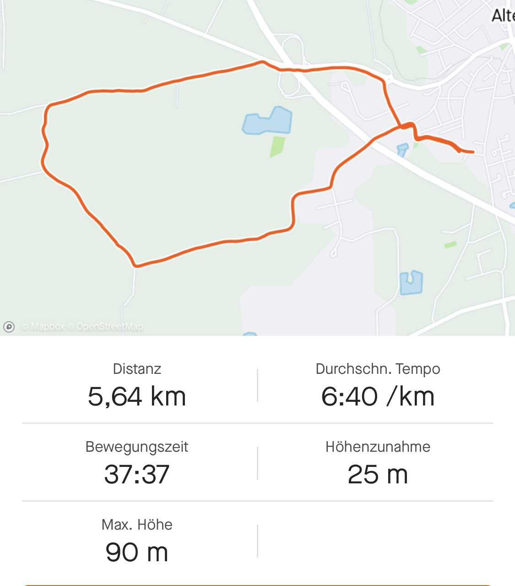
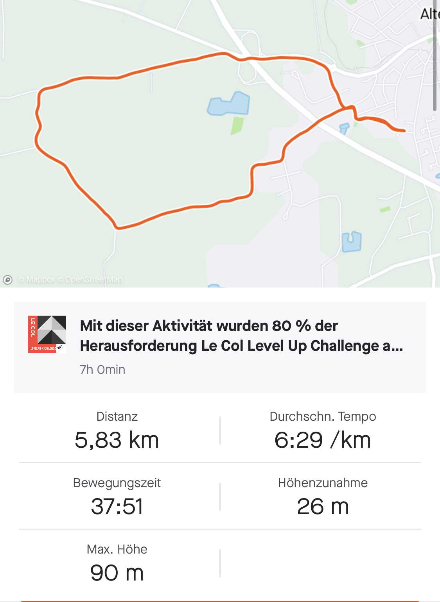

# Run on Streets

The ross package has the main purpose to match a trajectory out of a GPX file to the corresponding OSM streets to make different rounds comparable.
It was writen in context of the Spatial Data Science in R course in Summer term 2021 with Prof. Dr. Edzer Pebesma.

NOTE:
In case of a missing vignette, I recommend to run the following
```{r, eval = FALSE}
tools::buildVignettes(dir = ".", tangle=TRUE)
dir.create("inst/doc")
file.copy(dir("vignettes", full.names=TRUE), "inst/doc", overwrite=TRUE)
```


```{r, include = FALSE}
knitr::opts_chunk$set(
  collapse = TRUE,
  comment = "#>"
)
```


```{r setup, inlcude = FALSE}
library(ross)
library(sf)
library(osmdata)
library(tidyverse)
library(units)
library(leaflet)
library(stats)
```

## Introduction 
People like to locate themselves. Whenever they want to know where they are, where they want to go or where they come from, they usually use GPS devices to locate themselves on a map.
Besides navigation, tracking is very common.

When people for a run, they start their GPS device to track their path with location and timestamp and sometimes also further information like heartrate. 

A usual runner has some standard routes around his or her house so, one usually wants to compare running statistics on that route. 
A comparison between a Samsung Watch and an Apple Watch showed, that the distance can be up to 700m different on a 5km run. So, a comparison is impossible.

There are two possible ways: One needs to know the noise and processing of the GPS tracks per device to add e.g. a Kalman Filter that can smooth the track and a new distance can be calculated. A second approach is that every route happend on known paths and streets. Therefore, tracks from both watches can be mapped to the closest path or street.

When the track with its timestamps is mapped to the street where both watches were at the same time, the route becomes comparable again.

## Data


The dataset about a run are stored in apps like Strava or Runtastic.
Strava understands itself as a data handler. For a developer there are three different ways to access data:
* via API as json
* via download as fit data file
* via download as GPX data file

Since the API is limited to a certain amount of requests, this computation is based on GPX data. In a next step the connection to the API is aimed. Ben Davies wrote a [package for an access to the API via R](https://bldavies.com/blog/accessing-strava-api/).


In the following computations two runs are taken into account. One was tracked with a Samsung Watch, the other with an Apple Watch. Both runners ran together. The run started on 2021-05-07T06:34:36Z and ended on at 2021-05-07T07:12:38. The computed distance from the Samsung watch was 5.64km against 5.83km with Apple watch. The Samsung watch measured an average speed of 6:40minutes per kilometer and a total movement time of 37:37km. The apple watch measured 6:29 minutes per kilometer and a total movement time of 37:51min.


```{r, out.width="50%", fig.cap="Track with Samsung watch"}

```

```{r, out.width="50%", fig.cap="Track with Apple watch"}

```


```{r}
gpx_features_samsung = readGPXFile("../inst/extdata/track_samsung_watch.gpx")
gpx_features_apple = readGPXFile("../inst/extdata/track_apple_watch.gpx")

leaflet::addPolylines(leaflet::addTiles(leaflet::leaflet(points2line_trajectory(gpx_features_samsung))))
leaflet::addPolylines(leaflet::addTiles(leaflet::leaflet(points2line_trajectory(gpx_features_apple))))

bbox <- sf::st_bbox(gpx_features_samsung)
osm_features = readOSMFiles(bbox)
plot(osm_features$osm_lines)

```


## Results


In a first step all outliers will be removed. This is an important step because whenever the GPS signal gets bad (e.g. because of high buildings around, the position can jump around. This will be smoothed by that.
The threshold of 2.5m shows that the function is working. Since the chosen tracks have no outliers like this, no entries need to be removed.
```{r}
threshold = 2.5
#demo to show that function is working
filterForClosePoints(gpx_features_samsung, threshold)


threshold = 10
gpx_features_samsung_filtered = filterForClosePoints(gpx_features_samsung, threshold)

threshold = 10
gpx_features_apple_filtered = filterForClosePoints(gpx_features_apple, threshold)
```


After preparing the tracks, the measurement points along the track need to be mapped to the OSM features. Therefore, the closest distance between the feature and the OSM features is calculated. If the distance threshold is adhered, the track is shifted to the feature. If not, the point on track is kept.
```{r}
threshold = 10
#Samsung
gpx_features_samsung_osm = bringFeatureToOSM(gpx_features_samsung, osm_features, threshold)
#saveGPXFile(gpx_features_samsung_osm, "./inst/extdata/track_samsung_watch_smoothed.gpx")
#Apple
gpx_features_apple_osm = bringFeatureToOSM(gpx_features_apple, osm_features, threshold)
#saveGPXFile(gpx_features_samsung_osm, "./inst/extdata/track_apple_watch_smoothed.gpx")
```


The evaluation function shows running statistics about the new computed track.

### Samsung
```{r}
#Samsung
evaluateTrack(gpx_features_samsung_osm)

```


### Apple
```{r}
#Apple
evaluateTrack(gpx_features_apple_osm)
```


## Discussion

The results show that the distance of the two tracks is the same after processing (5.91km). Before they had a difference of 190m (5.64km and 5.83km). The average speed became a bit slower.

The issue of different distance computations by different watches can be minimized with this package. The results of a Samsung watch and an Apple watch become comparable.


The maps and especially the speed plot show that matching the track to the OSM path is difficult at junctions and places where many paths are close together or meet each other. The computation must be improved at such places. 
As a next step the heading of the track and the corresponding OSM feature part should be recognized for that. The issue with jumping points on features at junctions can be solved by that.


## References
* [Strava in R API](https://bldavies.com/blog/accessing-strava-api/).
* [Read GPX data](https://geocompr.github.io/geocompkg/articles/gps-tracks.html?tag=makemoney0821-20)
* [Read OSM data](https://dominicroye.github.io/en/2018/accessing-openstreetmap-data-with-r/)


